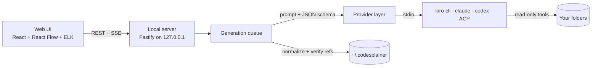

# Codesplainer

Understand any codebase, one diagram at a time.

Ask a question about your code and get a small diagram back, not a wall of text. Click any box to **Explain & expand** it into a deeper diagram, and keep going down to functions and line ranges. Every conversation is a tree of diagrams, and you can always see where you are: in the outline, the breadcrumbs, and the conversation map.

The answers come from AI coding agents already installed on your machine (Kiro CLI, Claude Code, Codex or any [ACP](https://agentclientprotocol.com) agent). They read your code locally, read-only. Codesplainer itself runs on `127.0.0.1` and has no accounts or telemetry.

[Download the desktop app](https://guydea.github.io/codesplainer/#download) for macOS, Windows or Linux, or [try the demo](https://guydea.github.io/codesplainer/demo/?sample=flow) in your browser.

## Features

- **Diagrams first.** Each answer is one diagram of 3–14 boxes, depending on the detail level. Titles have at most 6 words and box labels 1–3 words. A one-sentence summary gives the answer, and 1–3 highlighted boxes mark where it is in the diagram.
- **Explain & expand.** Double-click a box (or press `E`) to get a diagram of its insides. Big repos start with abstract boxes (subsystems, folders), and each expansion goes one level deeper: module → files → functions → steps with line ranges.
- **Ask anywhere.** Ask a new question, a follow-up about the current diagram, a question about one box, or about lines you selected in the code viewer.
- **Discussion structure.**
  - The outline tree, breadcrumbs, and the conversation map show every diagram as a card.
  - Map edges start at the exact box that was expanded.
  - Boxes that already have child diagrams show a badge.
- **Step through.** Flows and sequences play one numbered step at a time (`P`, then `,` / `.`). The diagram lights up as the steps go by, and the code viewer follows each step's lines.
- **Code level.**
  - Boxes link to files and line ranges, opening in the built-in code viewer (CodeMirror) or in your editor.
  - Arrows link to the line where the call, import or event happens, so every connection can be checked.
  - You can browse the whole workspace in the file explorer.
- **Workspaces** can hold one or more folders, for example a backend and a frontend together.
- **Import / export.**
  - Conversations export as `*.codesplainer.json`, with agent sessions stripped. You can re-import them on another machine and map folders to local paths.
  - They also export as Markdown with Mermaid diagrams.
  - A whole workspace exports as one bundle.
  - Single diagrams export as PNG, SVG, Mermaid or JSON.
- **Live progress.** You see the agent's tool calls ("Reading lib/hooks.js…") while it works, and can cancel, retry, retry with another agent, or retry at another detail level. Several diagrams can generate in parallel.
- **Session reuse.** For Claude Code and Codex, expansions and follow-ups fork the parent diagram's agent session, so the agent doesn't re-read what it already knows.
- **Keyboard first.** Command palette (`Ctrl/⌘ K`), shortcuts for every main action, and light/dark theme.
- **Desktop app or browser.** Install the app for macOS, Windows or Linux, or run Codesplainer from source and use it in your browser. Both use the same settings and conversations.
- **Offline demo provider.** It builds diagrams from folder structure and imports without any AI, so you can try the UI without an agent.

## Quick start

### Desktop app

Download the installer for your system from the [download page](https://guydea.github.io/codesplainer/#download) or the [latest release](https://github.com/GuyDea/codesplainer/releases/latest). You also need at least one agent CLI (see [Agents](#agents)).

The installers are not signed yet, so macOS and Windows ask for confirmation the first time:

- **macOS:** open the app once, then go to System Settings → Privacy & Security and click **Open Anyway** (or run `xattr -dr com.apple.quarantine /Applications/Codesplainer.app`).
- **Windows:** if SmartScreen warns about the installer, click **More info**, then **Run anyway**.

On Linux, install the `.deb` with `sudo apt install ./Codesplainer-linux-amd64.deb`, or make the AppImage executable with `chmod +x Codesplainer-linux-x86_64.AppImage`. The AppImage needs `libfuse2` (`libfuse2t64` on Ubuntu 24.04).

The app keeps its settings and conversations in `~/.codesplainer` (or `CODESPLAINER_HOME`), the same place as the command line version. Only one server uses a data directory at a time: if `npm start` is already running, the app shows that server in its window, and while the app is open, `npm start` exits with a message instead of starting a second server.

### From source

Requires Node.js 22.12+ and at least one agent CLI (see [Agents](#agents)).

```bash
npm install
npm run build
npm start                       # http://127.0.0.1:4777
npm start -- ~/code/my-repo     # open a folder directly (creates a workspace for it)
```

Options: `--port <n>`, `--host <host>`, `--data-dir <dir>`, `--no-open` (env: `CODESPLAINER_PORT`, `CODESPLAINER_HOST`, `CODESPLAINER_HOME`, `CODESPLAINER_NO_OPEN=1`). Settings and conversations live in `~/.codesplainer`.

### Development

```bash
npm run dev            # API on 4777, Vite UI with hot reload on 5173 (or the next free port)
npm run check          # typecheck + lint + all tests
npm run desktop        # build the UI and open it in the desktop app (downloads Electron the first time)
npm run dist:desktop   # installers for this OS, in packages/desktop/release/
npm run build:pages    # the GitHub Pages site, in site-dist/
```

Troubleshooting:

- **"Cannot find native binding"** (Vite/rolldown) or a missing `@esbuild/*` package: npm 11.5–11.6 deletes platform-specific packages when `npm install` runs a second time in a workspace ([npm/cli#8536](https://github.com/npm/cli/issues/8536)). Reinstall with `rm -rf node_modules packages/*/node_modules package-lock.json && npm install`, and upgrade npm (`npm install -g npm@11`, or any npm >= 11.7) so it doesn't happen again. `npm run doctor` checks for this, and `npm run dev`, `build`, `test` and the desktop and Pages builds refuse to start with a clear message while packages are missing.
- **Out of file watchers** (`EMFILE: too many open files, watch`): `npm run dev` detects this and falls back to polling (file changes are then noticed a moment later). To fix it permanently on Linux, raise the limit: `echo fs.inotify.max_user_instances=512 | sudo tee /etc/sysctl.d/60-inotify.conf && sudo sysctl --system`.
- **"… is already running … with the data directory ~/.codesplainer"**: another Codesplainer (the desktop app, `npm start` or `npm run dev`) uses that data directory. Use that one, stop it, or give this one its own directory with `--data-dir <dir>` (or `CODESPLAINER_HOME`).

The diagram components have a playground with sample diagrams in both themes: run the web dev server and open `/playground.html`. The [live demo](https://guydea.github.io/codesplainer/demo/?sample=flow) on the download page is the same playground, without the developer controls.

## Agents

Codesplainer finds the CLIs on your `PATH`, and also the binaries bundled with the VS Code, Cursor, Kiro and Windsurf extensions. On macOS and Linux the desktop app also reads the `PATH` your login shell sets up, so CLIs installed with Homebrew, npm, nvm and the like are found even when the app starts from the Dock or a menu. Pick one per question in the ask bar; the default and per-agent options are in **Settings → Providers**. Each agent card has **Test** and **Re-detect** buttons.

| Agent | How it runs | Notes |
|---|---|---|
| **Kiro CLI** | `kiro-cli acp` with a private read-only agent (read, grep and glob tools only, no MCP servers). | Model list comes from the CLI. Log in once with `kiro-cli login`. |
| **Claude Code** | `claude -p --output-format stream-json` with the `Read`/`Grep`/`Glob` tools, `--json-schema` output and `--permission-mode dontAsk`. | Forks sessions for follow-ups. Reports cost. |
| **Codex** | `codex exec --json -s read-only --output-schema …` | Forks sessions for follow-ups. Your Codex MCP servers are switched off per run. |
| **Custom ACP agent** | Any agent that speaks the Agent Client Protocol over stdio, e.g. `opencode acp`. | Only read/search tool permissions are granted, plus shell if you allow it. |
| **Demo (offline)** | No AI: builds diagrams from folders, imports and symbols. | Useful for trying the UI. |

**Codex on Linux:** if its bubblewrap sandbox can't start on your host, Codex shows as unavailable and says why. The **Run without sandbox** switch makes it usable, but then Codex is only *told* to stay read-only; nothing enforces it.

## How it works



1. A question becomes a diagram entry with an origin (`question`, `expand`, `ask-node`, `ask-graph`, `ask-code`). The origin links it to its parent diagram and box, and that link is what makes a conversation a tree.
2. The prompt includes:
   - the workspace folders;
   - a compact directory tree;
   - the path of questions so far, so the agent keeps the level of detail;
   - the parent diagram and the box being expanded;
   - strict size and word limits.

   The agent explores with read-only tools and answers with one JSON diagram.
3. The server normalizes the answer:
   - it accepts common synonyms and caps sizes;
   - it drops edges that point to boxes that don't exist;
   - it checks every code reference of boxes and arrows against the file system: missing files are removed and line ranges are clamped.

   If the answer is invalid, the agent gets one repair round. Progress streams to the UI over Server-Sent Events.

The desktop app is the same server and UI in one program: the server runs in Electron's main process and the UI in an app window.

## Security model

The server is meant for your machine only:
- It binds to `127.0.0.1` by default and warns you if you bind elsewhere.
- It only accepts requests whose `Host` is localhost and, when an `Origin` header is sent, whose origin is localhost too. This protects against DNS rebinding.
- Every request that changes anything must carry `x-codesplainer: 1`, which stops cross-site form posts.
- File access is limited to your workspace folders: path traversal and symlinks that point outside are rejected.
- Agents run read-only, as described in [Agents](#agents).
- The desktop app always binds to `127.0.0.1`. Its window is sandboxed (the page has no Node.js access), only shows the local server, and opens all other links in your browser.
- One server per data directory: the server that owns it is recorded in `instance.json` there. The desktop app only attaches to that server when its address is loopback `http` and it answers.

There is no authentication, so don't expose the port to a network.

## Project layout

```
packages/
  shared/   zod schemas + types = the contract (diagrams, conversations, API, events, settings),
            diagram normalizer, conversation-tree helpers, Mermaid/Markdown export
  server/   Fastify app
    src/agents/   providers (kiro, claude, codex, acp, mock), prompts, output schema, ACP client
    src/jobs/     queue + generation service     src/fs/  scanning, safe file access, refs
    src/routes/   HTTP API (see shared/src/api.ts) src/storage/  atomic JSON files
    src/start.ts  embedded start (desktop app)   src/instance.ts  one server per data directory
  web/      React UI
    src/graph/    diagram canvas, sequence view, conversation map, thumbnails (React Flow + ELK)
    src/panels/   outline, breadcrumbs, inspectors, code viewer, file explorer, ask bar, progress
    src/app, src/screens, src/dialogs, src/store (zustand), src/lib (API client, SSE, router)
  desktop/  Electron app: server in the main process, UI in a sandboxed window, login-shell PATH;
            installers configured in electron-builder.yml
site/       GitHub Pages download page (scripts/build-pages.mjs adds the playground as the demo)
scripts/    dev runner, doctor (environment checks), Pages build
.github/workflows/   ci.yml (check + builds), release.yml (installers → draft release), pages.yml
```

## Extending

- **New agent CLI:**
  1. Add a module under `packages/server/src/agents/providers/` that implements `AgentProvider` (`detect` + `run`). `acp.ts` and `kiro.ts` show how little an ACP agent needs.
  2. Register it in `agents/registry.ts`.
  3. Add its id to `PROVIDER_IDS` in `packages/shared/src/providers.ts`.
- **New box or edge kind:**
  1. Add it to `packages/shared/src/kinds.ts`, with a hint; the agents see it in the prompt.
  2. Give it an icon and color in `packages/web/src/graph/visuals.ts`.
- **Prompt tuning:** everything the agent is told lives in `packages/server/src/agents/prompt.ts`. The answer's shape is in `agents/schema.ts`.
- **API:** every endpoint is listed in `packages/shared/src/api.ts`, with zod schemas for the request bodies. The server validates requests with those schemas and the web client uses their types.

## Releasing

[CI](.github/workflows/ci.yml) runs `npm run check` and the format check, and builds the CLI, the desktop bundle and the Pages site on every push to `main` and on pull requests. Releases come from [release.yml](.github/workflows/release.yml):

1. Set the new version in every package and in `APP_VERSION`, commit, then tag and push:

   ```bash
   npm version 0.2.0 --workspaces --include-workspace-root --no-git-tag-version
   # and set APP_VERSION = '0.2.0' in packages/shared/src/version.ts
   git commit -am "Release 0.2.0"
   git tag v0.2.0
   git push origin main v0.2.0
   ```

2. The workflow checks that the tag matches both versions, runs `npm run check`, builds the installers on macOS, Windows and Linux, and attaches them to a draft release.
3. Review the draft on the Releases page and publish it. The download page links to `releases/latest/download/<file>`, so it offers the new installers as soon as the release is published.

To try the installers without a release, start the workflow by hand (**Actions → Release → Run workflow**); the installers are kept as workflow artifacts for 14 days. The builds are unsigned, apart from an ad-hoc signature on macOS.

**GitHub Pages:** set **Settings → Pages → Source** to **GitHub Actions** once. After that, every push to `main` deploys the download page and the demo ([pages.yml](.github/workflows/pages.yml)). The repository needs to be public: GitHub Pages on a free account and anonymous downloads of release files both require it.

## Keyboard shortcuts

| Key | Action |
|---|---|
| `/` | Ask a question |
| `E` / `Shift E` | Explain & expand the selected box / expand it again |
| `A` | Ask about the selected box |
| Arrow keys, `Enter` | Move between boxes, expand |
| `P` | Step through the numbered arrows |
| `,` / `.` | Previous / next step (`←` / `→` while the diagram has focus) |
| `U` or `Alt ←` | Parent diagram |
| `[` / `]` | Previous / next sibling diagram |
| `M` | Toggle the conversation map |
| `F` | Fit view |
| `Ctrl/⌘ K` | Command palette |
| `Ctrl/⌘ B` | Toggle sidebar |
| `Esc` | Close panel / clear selection |
| `?` | All shortcuts |
